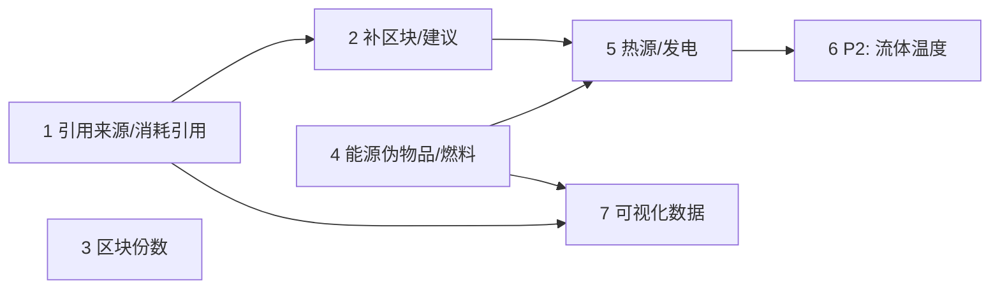

# 任务拆分与实施计划

- 实施补充：[implementation.md](implementation.md)（2026-10-05，含温度、对照验收及 HTML 可视化）
- 日期：2026-10-04
- 对应：[requirements.md](requirements.md)、[design.md](design.md)
- 基线：commit `b654adf`

## 约定

- 每个阶段结束时以下检查全部通过才进入下一阶段：
  ```powershell
  uv run --directory recipe-mcp pytest
  uv run --directory recipe-mcp mypy
  uv run --directory recipe-mcp ruff check
  ```
- "文件"列中的源码路径相对 `src/recipe_mcp/`；测试位于 `tests/`。
- 每个阶段一个 commit（提交信息遵循 `AGENTS.md`），文件保持 LF 换行。
- "完成标准"中的数值断言都写进测试。

## 阶段 1：引用来源、系数与消耗引用（US-A1、A2）

| # | 任务 | 文件 | 完成标准 |
|---|---|---|---|
| 1.1 | `TargetRef` 增加 `of`、`factor`；新增 `ConsumeRef`（`of` 默认 `surplus`）；`BlockRequest.consume` 接受引用 | `plans/models.py` | 旧方案文件读出后 `of="imports"`、`factor=1` |
| 1.2 | `references()` / `dependencies()` 同时扫描 targets 与 consume；`rename_block`、`remove_block` 覆盖 consume 引用；`check_block` 校验消耗引用 | `plans/ops.py`, `plans/factory.py`, `plans/store.py` | 删除被消耗引用的块 → 报错；重命名后消耗引用同步 |
| 1.3 | `resolve_amounts()`：按 `of` 取值、乘 `factor` 加 `plus`；消耗解析值 ≤ 1e-9 时移除并警告 | `plans/factory.py` | 合成：`of=surplus` 40 → 消耗 40、工厂处置 0；`factor=0.5` → 消耗 20、处置 20；`net_outputs` 只取正值 |
| 1.4 | 环检测包含消耗引用 | `plans/factory.py` | 合成：A 目标引用 B、B 消耗引用 A → 报环并给路径 |
| 1.5 | `plan_save` / `plan_edit` 工具文档更新 | `server.py` | stdio：保存一个带消耗引用的方案并求解 |

依赖：无。

## 阶段 2：补区块操作与建议（US-A3）

| # | 任务 | 文件 | 完成标准 |
|---|---|---|---|
| 2.1 | `add_supply_block`：目标引用 `for_block`，继承 `defaults`、`validate_stage`、`objective`（阶段 4 后加 `energy_mode`），`request` 浅合并 | `plans/models.py`, `plans/ops.py` | 合成：为导入 30 b 的块补供应块 → 求解后供应块目标 30，工厂 `net_inputs` 不再有 b |
| 2.2 | `add_consumer_block`：消耗引用 `for_block` 的溢出；缺 `lines` 与 `targets` 时报错 | `plans/ops.py` | 合成：补消耗块后工厂处置为 0 |
| 2.3 | `FactoryLedger.suggestions`：净输入 → `add_supply_block` 操作；处置项 → `add_consumer_block` 模板；`new_id` 冲突加序号 | `plans/factory.py` | 合成：suggestions 中的 `add_supply_block` 原样传给 `plan_edit` 能成功 |

依赖：阶段 1。

## 阶段 3：区块份数（US-A4）

| # | 任务 | 文件 | 完成标准 |
|---|---|---|---|
| 3.1 | `plan()` 新增 `copies`；连续求解后生成 `per_copy` 与 `copies_totals` | `planner/api.py`, `planner/report.py`, `planner/schema.py` | 合成：4.8 台 × 4 份 → 每份 1.2 台、取整 2，`copies_totals.machines_ceil` = 8；`copies=1` 时 `per_copy` 为 null |
| 3.2 | 整数模式按 1 份求解再乘回（目标、消耗、可加约束、固定 / 上限台数均除以份数） | `planner/api.py` | 合成：整数解每份台数为整数，总台数 = 每份 × 份数 |
| 3.3 | `BlockRequest` 透传 `copies`；工厂汇总使用 `copies_totals` 的取整口径 | `plans/models.py`, `plans/factory.py` | 合成两块方案汇总 |

依赖：无（可与阶段 1–2 并行）。

## 阶段 4：能源伪物品、单位与燃料（US-B1、B2）

| # | 任务 | 文件 | 完成标准 |
|---|---|---|---|
| 4.1 | `energy.py`：`energy:` 键、`rate_factor()`；`Planner.key()` 接受 `energy:` 前缀 | `planner/energy.py`, `planner/model.py` | 单元：`energy:electric` 合法，`electric` 不是别名 |
| 4.2 | 所有 per 换算点改用 `rate_factor()`：目标 / 比例、consume、limits.imports、imports/surplus 输出、物品流、影子价格、瓶颈边际、弹性诊断、`plan_compare` | `planner/api.py`, `planner/report.py`, `planner/limits.py`, `plans/factory.py` | 合成：同一方案 `per=second` 与 `per=minute` 下能源数值相同、物料数值差 60 倍 |
| 4.3 | `energy_mode="balance"`：`line()` 按 design §3 表追加电、热、燃料项；能源键默认不可导入、可溢出、不处置 | `planner/model.py`, `planner/lp.py`, `planner/disposal.py` | 合成：`report` 模式全部现有测试结果逐字段不变；balance 下电力机器缺电源 → 不可行报错并提示写 `imports: ["energy:electric"]` 或加发电产线 |
| 4.4 | `pick_fuel()`：`spec.fuel` > `defaults.fuel` > 报错；类别、热值、阶段校验；`burnt_result`；`burns_fluid` 流体 | `planner/energy.py`, `planner/schema.py` | 合成：50 MW、效率 1 的燃烧机器烧 4 GJ 燃料 → 每台 0.0125/s，燃烧产物同量；类别不符报错 |
| 4.5 | 报告：`ItemFlow.unit`、`PlanLine.fuel` / `fuel_per_machine`、`Totals.heat_consumption_MW` | `planner/report.py`, `planner/schema.py` | 合成：`report` 模式下给了 `fuel` 时只出现在报告字段中 |

依赖：无（可与阶段 1–3 并行）。

## 阶段 5：热源与发电伪配方（US-B3、B4、B5）

| # | 任务 | 文件 | 完成标准 |
|---|---|---|---|
| 5.1 | `energy_line()` 与前缀识别：`generate:`、`solar:`、`wind:`、`heat:`；插件 / 信标非空报错；阶段校验 | `planner/energy.py`, `planner/model.py` | 合成：发电机 1 MW、效率 0.9、10 kJ → 每台 111.1 单位/s；目标 `energy:electric` 9 MW → 9 台、1000 单位/s |
| 5.2 | 反应堆：void / burner / fluid 三种能源；`neighbours` × `neighbour_bonus` | `planner/energy.py` | 合成：地热无输入；burner 反应堆燃料与乏燃料；`neighbours=2`、加成 1 → 3 倍热 |
| 5.3 | 太阳能、风机：`solar_factor` 默认 0.7、`wind_factor` 缺省报错；结果回显 `energy_factors` | `planner/energy.py`, `planner/api.py` | 合成：100 kW 面板 → 70 kW；用 `wind:*` 且未给系数 → 报错 |
| 5.4 | 自动发现：balance 下 `energy:*` 走伪配方枚举；放开 `turbine-open`、`turbine-closed` | `planner/model.py` | 合成：自动发现出 燃料 → 发电机 链 |
| 5.5 | 能源汇总字段（发电、热、净电） | `planner/report.py`, `planner/schema.py` | 合成：自供电方案 `net_electric_MW` ≥ −1e-6 |
| 5.6 | 真实数据：10 甲醇/秒 balance 热平衡闭合且有热源产线；`energy:electric` 10 MW 自动发现涡轮链 | `tests/test_planner_real.py` | 两项平衡误差 < 1e-6 |
| 5.7 | 工厂账本对能源键做 MW 直接抵消；`assumptions` 补共享电网 / 热网；`add_supply_block` 继承 `energy_mode` | `plans/factory.py`, `plans/ops.py` | 合成两块：A 发电 10 MW、B 耗电 6 MW 并引用 A → 净输出 4 MW |
| 5.8 | `solve_production` / `machine_stats` 参数与文档；README 能源章节 | `server.py`, `README.md` | stdio：balance 模式求解一次；README 示例逐条运行成功 |
| 5.9 | 性能检查：balance 模式 1000 条候选 < 2 s；含能源链的 10 块方案 < 5 s | 临时脚本（不提交） | 结果记录到最终说明 |

依赖：阶段 4。

## 阶段 6（P2）：流体温度（US-C1）

| # | 任务 | 文件 | 完成标准 |
|---|---|---|---|
| 6.1 | 触发检测；无温度约束时完全跳过 | `planner/temperature.py`, `planner/api.py` | 真实数据（Nullius）结果与未启用时逐字段一致 |
| 6.2 | 温度键拆分与零成本匹配列；导入只建在原料键 | `planner/temperature.py`, `planner/lp.py` | 合成：165° 与 500° 蒸汽，只收 ≥ 500° 的消费者只取 500° |
| 6.3 | 矩阵求解器同样拆分；报告合并显示并给 `temperatures` 明细 | `planner/matrix.py`, `planner/report.py` | 合成：矩阵与 LP 结果一致 |
| 6.4 | 非燃烧型发电机按实际流体温度计算功率 | `planner/energy.py` | 合成：165° 蒸汽进 500° 上限的机组，功率按 165° 计 |

依赖：阶段 5。

## 阶段 7：可视化数据（US-D1–D3）

| # | 任务 | 文件 | 完成标准 |
|---|---|---|---|
| 7.1 | `GraphNode` / `GraphEdge` / `ProductionGraph` 模型；`graph_options.format` 预留报错 | `planner/schema.py` | 传 `format="mermaid"` → "未实现" |
| 7.2 | `build_line_graph()`：二部边、端点、守恒断言、`depth` | `planner/graph.py` | 合成（重油裂解夹具，目标石油气）：每个物品节点流入 = 流出（< 1e-6）；depth：`target:petro` 0、`item:petro` 1、`line:lc` 与 `line:aop` 2、`item:light` 3、`line:hc` 4 |
| 7.3 | 分摊边（`allocate=true`） | `planner/graph.py` | 合成：两个生产者 3:1 供给两个消费者 → 分摊边 rate 闭式校验，带 `allocated` 标注 |
| 7.4 | `solve_production` 的 `graph` / `graph_options` 参数；矩阵、整数、不可行、能源（balance）结果都能出图 | `planner/api.py`, `server.py` | 默认结果不含 `graph`；四种结果各出一次图且守恒 |
| 7.5 | 工厂图：区块节点、输入输出边、link 边（含 `of` 与解析值）、工厂端点；`full` 带前缀子图 | `plans/factory.py` | 合成链接方案：link 边解析值 = 下游导入；`full` 中子节点 id 均以 `block:<id>/` 开头 |
| 7.6 | 体积检查：真实数据甲醇 + 塑料方案的图 < 200 KB | 临时脚本（不提交） | 结果记录到最终说明 |
| 7.7 | stdio：`solve_production` 与 `plan_solve` 各请求一次图；README 可视化数据说明 | `tests/test_mcp_stdio.py`, `README.md` | 通过 |

依赖：7.1–7.4 不依赖其他阶段，可最先做；7.5 依赖阶段 1（引用来源）；能源节点的 MW 单位依赖阶段 4。

## 依赖关系



阶段 1、3、4 互不依赖，可并行；5.7 用到阶段 2 的补区块操作；7.1–7.4（产线图）可以最先做，7.5（工厂图）等阶段 1。

## 需求覆盖

| 需求 | 任务 |
|---|---|
| US-A1 | 1.1, 1.3 |
| US-A2 | 1.1–1.5 |
| US-A3 | 2.1–2.3 |
| US-A4 | 3.1–3.3 |
| US-B1 | 4.1–4.3, 4.5 |
| US-B2 | 4.4, 4.5 |
| US-B3 | 5.1, 5.2, 5.4, 5.6 |
| US-B4 | 5.1, 5.3, 5.4, 5.6, 5.8 |
| US-B5 | 5.5, 5.7 |
| US-C1 | 6.1–6.4 |
| US-D1 | 7.1–7.4 |
| US-D2 | 7.5 |
| US-D3 | 7.1 |
| NFR-1 | 1.1, 3.1, 4.3, 6.1 |
| NFR-2 | 5.9 |
| NFR-3 | 4.3, 5.6 |
| NFR-4 | 4.5, 5.3 |
| NFR-6 | 7.4, 7.6 |
