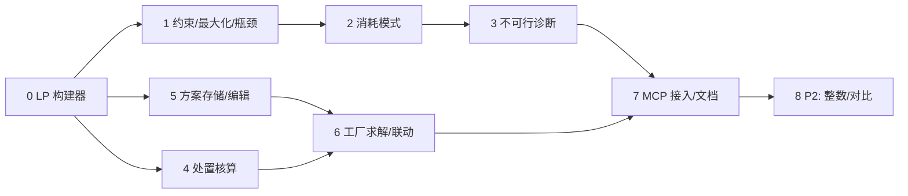

# 任务拆分与实施计划

- 日期：2026-10-04
- 对应：[requirements.md](requirements.md)、[design.md](design.md)
- 基线：commit `5007663` + 项目结构重构（uv src 布局）

## 约定

- 每个阶段结束时，运行以下命令且全部通过后才进入下一阶段：
  ```powershell
  uv run --directory recipe-mcp pytest
  ```
- "文件"列中的源码路径相对 `src/recipe_mcp/`；测试位于 `tests/`。
- 每个阶段一个 commit（Conventional Commits），只包含本阶段文件，不带入工作区里其他未跟踪的文件（`pressure-*` 等）。
- 文件保持 LF 换行（与仓库现状一致）。
- "完成标准"中的数值断言都写进测试，不只是人工查看。

## 阶段 0：LP 构建器重构（无行为变化）

| # | 任务 | 文件 | 完成标准 |
|---|---|---|---|
| 0.1 | 在 `planner/lp.py` 新增 `LPBuilder`，按名称登记列（x/m/u/s/n）与行（等式/不等式），输出 `c, A_eq, b_eq, A_ub, b_ub, bounds`（`scipy.sparse.csr_matrix`）以及解析回字典的映射 | `planner/lp.py` | 单元断言：列和行的名称可逆映射 |
| 0.2 | 把 `lp.solve_lp` 改为调用 `LPBuilder`；返回结构不变 | `planner/lp.py` | `tests/` 原有测试全部通过；10 甲醇/秒的目标函数值与重构前一致（13.7245，差 < 1e-9） |
| 0.3 | 给 `plan()` 的结果增加 `status: "optimal"` 字段 | `planner/api.py` | 新字段存在，其他字段不变 |

依赖：无。commit：`refactor: extract LP builder`

## 阶段 1：约束、最大化、瓶颈（US-A1、A2、A3、A6）

| # | 任务 | 文件 | 完成标准 |
|---|---|---|---|
| 1.1 | 解析 `limits`：未知键报错；`imports` 键并入可导入集合并设上界；`machines_by_type` 校验机器名存在 | `planner/lp.py` | 拼错的键、未知机器各有对应报错 |
| 1.2 | 约束行：`power_MW`、`machines`、`machines_by_type`、`pollution_per_minute`（口径见 design §3.3） | `planner/lp.py` | 合成：电力上限下 `totals.power_MW ≤ limit + 1e-6` |
| 1.3 | `mode="maximize"`：变量 s、比例校验（空 / ≤ 0 报错）、阶段 1 max s、无界报错、阶段 2 固定 s 后最小化成本 | `planner/lp.py`, `planner/api.py` | 合成：原油上限 100/s、石油气比例 1 → `scale` = 97.5；两个目标按 1:2 比例时产出比误差 < 1e-6；无约束时报"unbounded" |
| 1.4 | `limits_usage` 与 `bottlenecks`（阶段 1 对偶值，换算到 `per`；紧约束判定见 design §3.5） | `planner/lp.py`, `planner/report.py` | 合成：原油边际 = 0.975（每秒），`per="minute"` 时同样为 0.975（比例与上限都按分钟），符号为正 |
| 1.5 | 目标模式下也应用约束，并报告紧约束的边际成本 | `planner/lp.py` | 合成：加不紧的约束后解不变，`limits_usage` 中利用率 < 1 |
| 1.6 | `solve_production` 增加 `mode`、`limits` 参数和文档字符串 | `server.py` | stdio 调用一次最大化模式 |
| 1.7 | 真实数据测试：石灰石或箱装石灰石上限下最大化甲醇，有瓶颈输出 | `tests/test_planner_real.py` | `scale > 0`，`bottlenecks` 中含该导入约束 |

依赖：阶段 0。commit：`feat(planner): limits, maximize mode and bottlenecks`

## 阶段 2：原料输入 / 消耗（US-A4）

| # | 任务 | 文件 | 完成标准 |
|---|---|---|---|
| 2.1 | LP：`consume` 进入平衡行右端，消耗物品不建导入/溢出变量；与 `targets` 重叠报错 | `planner/lp.py` | 合成：消耗原油 100、最大化石油气 → 97.5 |
| 2.2 | LP 自动发现在没有目标时报错（要求给出 `lines` 或比例目标） | `planner/api.py` | 报错信息包含建议 |
| 2.3 | 矩阵求解器：`consumed_input` 角色；`targets` 可为空的条件（有消耗或固定产线）；没有确定规模的量时报错；与 `maximize` / `limits` / `integer_machines` 同时出现报错 | `planner/matrix.py`, `planner/api.py` | 合成：矩阵模式消耗 100 原油（aop/hc/lc）→ 石油气溢出 97.5，平衡误差 < 1e-9 |
| 2.4 | `production_matrix` 支持 `consume` 参数（角色与自由度报告） | `planner/api.py`, `server.py` | 角色中出现 `consumed_input` |
| 2.5 | 真实数据测试：`consume` 35 压缩氧气/秒 + `mode="maximize"` 甲醇比例 1，自动发现产线 | `tests/test_planner_real.py` | 可行时：`items` 中压缩氧气 `consumed` − `produced` = 35（误差 < 1e-6），且无导入/溢出。若不可行，本阶段断言抛出 `ValueError`，阶段 3.4 再把断言改为结构化诊断 |

依赖：阶段 1（共用 LP 构建器的平衡行）。commit：`feat(planner): consume (input-driven) mode for lp and matrix`

## 阶段 3：弹性不可行诊断（US-A5）

| # | 任务 | 文件 | 完成标准 |
|---|---|---|---|
| 3.1 | 不可行检测（HiGHS status 2）且有约束或消耗时，构建弹性 LP（design §3.6） | `planner/lp.py` | 无约束时的不可行仍抛出原来的错误 |
| 3.2 | 结构化返回：`status:"infeasible"`、`infeasibility`、`suggestions`、`note` | `planner/api.py`, `planner/report.py` | 合成：目标 100 石油气 + 原油上限 50 → 返回目标可达 48.75（=50×0.975），原油上限无缺口。理由：每单位石油气放宽上限的相对代价为 (100/97.5)/50 ≈ 0.0205，削减目标为 1/100 = 0.01，弹性 LP 全部选择削减目标 |
| 3.3 | `fixed_machines` 冲突时弹性 LP 仍不可行 → 报错指向固定产线 | `planner/lp.py` | 合成冲突用例 |
| 3.4 | 最大化模式在固定产线/消耗冲突时同样走诊断 | `planner/lp.py` | 合成用例 |

依赖：阶段 2。commit：`feat(planner): elastic infeasibility diagnosis`

## 阶段 4：副产物处置核算（US-A7）

| # | 任务 | 文件 | 完成标准 |
|---|---|---|---|
| 4.1 | `void_by_key` 索引（单一投入、产出期望为 0） | `planner/disposal.py` | 真实数据识别出 42 个 Nullius 销毁配方 |
| 4.2 | `disposal_for(surplus, defaults)`：阶段过滤、`efficient` 默认、选台数最少的配方 | `planner/disposal.py` | 真实数据：压缩氧气或氧气溢出选择零耗电的烟囱设备 |
| 4.3 | `plan()` 输出 `disposal`、`disposal_totals`、`totals_with_disposal`、`disposal_unhandled`；`disposal="none"` 关闭；`solve_production` 增加参数 | `planner/disposal.py`, `planner/api.py`, `server.py` | 合成：加一个销毁配方 + 销毁机器，溢出 45 → 台数闭式校验 |

依赖：阶段 0（与阶段 1–3 无耦合，可与之并行）。commit：`feat(planner): surplus disposal accounting`

## 阶段 5：方案存储与编辑（US-B1、B2、B3、B6、B8）

| # | 任务 | 文件 | 完成标准 |
|---|---|---|---|
| 5.1 | `PlanStore(root)`：名称校验、路径包含检查、1 MB 上限、原子写、JSON 解析错误处理、schema 校验 | `plans/store.py`, `paths.py` | `../x`、`a/b`、`..`、超长名称均被拒绝；写入中途抛异常时原文件不变 |
| 5.2 | `save` / `get` / `list`；保存时校验请求键白名单与产线可构建 | `plans/store.py` | 非法请求键或不存在的配方 → 报错且不写盘 |
| 5.3 | 指纹与过期判定（`fresh` / `stage_changed` / `prototypes_changed`） | `plans/store.py` | 篡改夹具中的指纹 → 标记正确 |
| 5.4 | `edit`：design §6.4 的全部操作，内存副本 + 全量校验 + 修订号；`expected_revision` 冲突 | `plans/ops.py` | 一组操作中最后一个失败 → 文件与修订号均不变；冲突报错含当前修订号 |
| 5.5 | `pin`：依赖块结果；切换矩阵求解器后机器总数一致 | `plans/ops.py` | 真实数据：甲醇块 pin 前后机器总数差 < 1e-6 |
| 5.6 | `delete`：`confirm` 校验，移入 `.trash/`，`list` 不显示 | `plans/store.py` | 断言回收站文件存在 |
| 5.7 | 新建 `tests/test_plans.py`（`tmp_path` 夹具 + `realdata` 小用例） | `tests/test_plans.py` | 全部通过 |

依赖：阶段 0（需要 `plan()` 的 `status` 字段）；pin 需要阶段 5.2 的结果存储。commit：`feat(plans): plan store, edit ops and staleness`

## 阶段 6：工厂求解、汇总与联动（US-B4、B5）

| # | 任务 | 文件 | 完成标准 |
|---|---|---|---|
| 6.1 | 引用目标的校验（`from` 列表 / `*` / `plus`）；`remove_block`、`rename_block` 维护引用 | `plans/ops.py`, `plans/factory.py` | 删除被引用的块 → 报错；重命名后引用同步 |
| 6.2 | 依赖闭包 + Kahn 拓扑 + 环路径 | `plans/factory.py` | 合成环 A→B→A 报错并给出路径 |
| 6.3 | 按序求解、解析引用、单块错误隔离 | `plans/factory.py` | 合成：下游块导入 X=30 → 上游块目标解析为 30（+`plus`） |
| 6.4 | 工厂账本与处置重算（design §6.5 公式） | `plans/factory.py` | 合成两块：A 溢出 40 氧气、B 导入 25 → `internal`=25、处置 15 |
| 6.5 | `save_results` 写回摘要和指纹；`detail` 参数 | `plans/factory.py`, `plans/store.py` | 写回后 `stale="fresh"`，修订号 +1 |
| 6.6 | 真实数据：甲醇块 + 引用甲醇的下游块（例如 `nullius-pressure-methanol` 的消费配方之一）方案求解 | `tests/test_plans.py` | 汇总平衡：Σout − Σin 与 net_out − net_in 一致 |

依赖：阶段 5；处置部分依赖阶段 4。commit：`feat(plans): factory solve, ledger and block links`

## 阶段 7：MCP 接入与文档

| # | 任务 | 文件 | 完成标准 |
|---|---|---|---|
| 7.1 | 工具 `plan_list`、`plan_get`、`plan_save`、`plan_edit`、`plan_solve`、`plan_delete`；`create_server` 以 `paths.PLANS_DIR` 初始化 `PlanStore` | `server.py` | `recipe-mcp-client` 列出 20 个工具 |
| 7.2 | `tests/test_mcp_stdio.py`：工具数 20；每个新工具调用一次；非法名称、修订冲突返回 isError；测试方案用唯一前缀并在结束时删除 | `tests/test_mcp_stdio.py` | 通过；运行后 `data/plans/` 下不残留测试方案（回收站中的测试文件一并清理） |
| 7.3 | README：计算模式、方案管理、示例命令、假设与限制 | `README.md` | 示例命令逐条实际运行成功 |
| 7.4 | 性能检查：1000 条候选的最大化 + 弹性诊断 < 2 s；10 块方案 < 5 s | 临时脚本（不提交） | 结果记录到最终说明 |

依赖：阶段 1–6。commit：`feat(mcp): plan management tools and docs`

## 阶段 8（P2，可延后）

| # | 任务 | 文件 | 完成标准 |
|---|---|---|---|
| 8.1 | 整数模式：`milp`、耦合行、时限、gap、400 条上限、两阶段 | `planner/lp.py`, `server.py` | 合成：对比连续解与整数解，整数台数满足需求，`mip_gap` 有输出 |
| 8.2 | `plan_compare` | `plans/factory.py`, `server.py` | 两个合成方案的差值断言；工具数 21 |

## 依赖关系



## 需求覆盖

| 需求 | 任务 |
|---|---|
| US-A1 | 1.1–1.3, 1.6, 1.7 |
| US-A2 | 1.3 |
| US-A3 | 1.1, 1.2 |
| US-A4 | 2.1–2.5 |
| US-A5 | 3.1–3.4 |
| US-A6 | 1.4, 1.5 |
| US-A7 | 4.1–4.3, 6.4 |
| US-A8 | 8.1 |
| US-B1 | 5.1, 5.2, 7.1 |
| US-B2 | 5.4, 7.2 |
| US-B3 | 5.5 |
| US-B4 | 6.3–6.5 |
| US-B5 | 6.1–6.3 |
| US-B6 | 5.3, 6.5 |
| US-B7 | 8.2 |
| US-B8 | 5.6 |
| NFR-1 | 0.2, 7.2 |
| NFR-2 | 7.4 |
| NFR-3 | 1.3, 1.4, 2.3 |
| NFR-4 | 5.1 |
| NFR-6 | 5.3, 6.5 |
